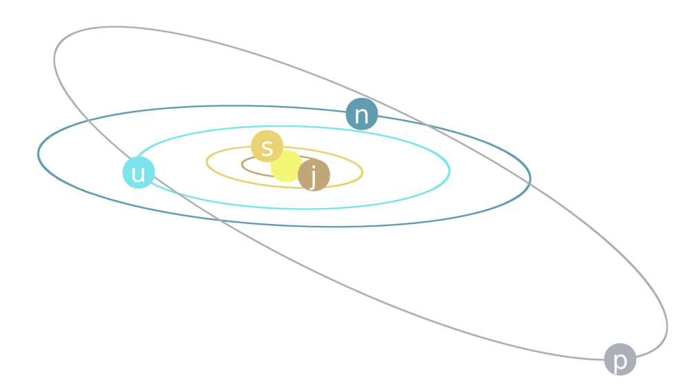

# simplectic
C programs to check numerical methods applied to different physical potentials.

## Getting Started
For compile this programs you need the gcc libquadmath if you want quad-precision. In Debian GNU/Linux you can do this:
```
apt install libquadmath0
```
For compile the codes you only do:
```
make
```
# Configuration
In the coef directory there are all methods that you can use for the different systems.   
In the cnf directory there are configuration files for Sun, planets and Pluto in the case of solar potential. These files has the name, mass, position (x, y, z) and speed (x, y, z). There is another file call param.cnf for some parameters of the execution.
## Running
You can run the program with:
```
./simplectic [potential] [method_1] [method_2] [h] [tf] [it]
```
Where [potential] is the potential of physical system that you want to use, there are:
* solar - Solar system
* kepler - Two body kepler problem
* harmonic - Harmonical oscillator
* molecular - Lennard-Jones potential
* fput - Fermi-Pasta-Ulam-Tsingou

[method_1] is the kind of method and [method_2] are the numbers that identifies the method. For example if you want to use the method with filename pss_4_4_4.cnf in coef directory you have [method_1] = pss and [method_2] = 4_4_4.
[h] is the stepsize, [tf] is the final time of evolution and [it] is how many iterations that you want to print.
```
./simplectic solar sa 9_6 10 200000 1
```
this execute the "simplectic" program with solar system potential for the method sa_9_6 with h=10 and the results will be written in dat folder. You can use the scripts in "plt" folder for graphing these results.

## References
* S. Blanes and F. Casas: A Concise Introduction to Geometric Numerical Integration. CRC Press.
* E. Hairer, Ch. Lubich, and G. Wanner: Geometric Numerical Integration. Structure-Preserving Algorithms for Ordinary Differential Equations, Springer. 

## Autors
* **Cosmo Cat**  [cosmogat](https://github.com/cosmogat)
## License
See the [LICENSE](LICENSE)
